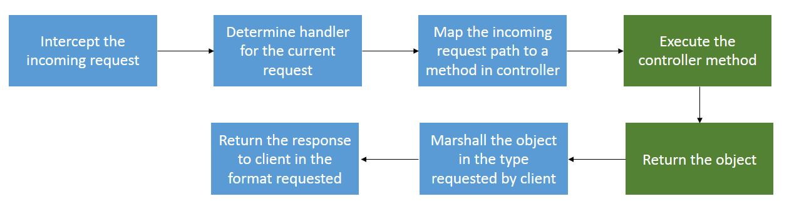

# spark-boot
Spark boot makes it easy to create stand-alone, production-grade Spark applications.

This new idea consists in create an abstraction layer over Spark in order to be able to support features and extensions with ease.
The **core** idia will be based in the following diagram:

## Planned Features:
- **JSR-330**: Dependency Injection (Guice or Dagger 2)
- **JSR 339**: Annotation based endpoint mapping
- **JSR-380**: Beans Validation 2.0
- Marshalling and Unmarshalling of requests/responses
- Swagger doc using OpenAPI Specification https://swagger.io/specification/
- Swagger code generator
- ect
